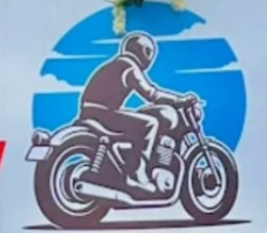

# moon-bilkes
Official website for Moon Bikes, Chennai.
[moon.html](https://github.com/user-attachments/files/23469391/moon.html)
<!doctype html>
<html lang="en">
<head>
  <meta charset="utf-8" />
  <meta name="viewport" content="width=device-width, initial-scale=1" />
  <title>Moon Bikes — Showroom</title>
  <!-- Use a clean modern font from Google Fonts -->
  <link href="https://fonts.googleapis.com/css2?family=Poppins:wght@300;400;600;700&display=swap" rel="stylesheet">
  
</head>
<body>
  

    <header>
      

        

        

          <h1>Moon Bikes — Multi Brand Two Wheelers</h1>
          
No.10 D, Ethiraj Swamy Salai, Erukkancherry, Chennai - 600 118

        

      

      

        <a class="phone" href="tel:+919884445509">+91 9884445509</a>
        
Open: 9:00 AM — 8:00 PM

      

    </header>

    <section class="hero">
      

        
NOW OPEN<small>Walk-ins welcome • Instant delivery on select models</small>

        <!-- Background-based showroom image avoids cropping and keeps the entire sign visible -->
        

        

      

      <aside class="hero-card info">
        <h2>Book Your Bike Consultation</h2>
        
Moon Bikes showroom is open! Fill out the short form below to schedule a consultation, pick a model, and choose payment type (Full cash or EMI). We'll contact you to confirm.

        <!-- Form connected to Formspree (endpoint provided) -->
        <form action="https://formspree.io/f/xpwlobqd" method="POST" accept-charset="UTF-8">
          <input type="hidden" name="_subject" value="New bike consultation request — Moon Bikes">

          <label for="name">Full Name</label>
          <input id="name" name="name" type="text" placeholder="Your full name" required>

          <label for="phone">Phone Number</label>
          <input id="phone" name="phone" type="tel" placeholder="10-digit mobile number" pattern="[0-9]{10}" required>

          <label for="email">Email (optional)</label>
          <input id="email" name="email" type="email" placeholder="you@example.com">

          <label for="model">Select Bike Model</label>
          <select id="model" name="model" required>
            <option value="" disabled selected>Choose model</option>
            <option>Hero Splendor Plus</option>
            <option>Hero HF Deluxe</option>
            <option>Hero Glamour</option>
            <option>Hero Xtreme 160R</option>
            <option>Honda CB Shine</option>
            <option>Honda SP 125</option>
            <option>Honda Activa (Scooter)</option>
            <option>TVS Apache RTR 160</option>
            <option>TVS Apache RTR 200</option>
            <option>TVS Jupiter (Scooter)</option>
            <option>Yamaha FZ-FI</option>
            <option>Yamaha R15</option>
            <option>Yamaha MT-15</option>
            <option>Bajaj Pulsar 150</option>
            <option>Bajaj Pulsar NS200</option>
            <option>Bajaj Dominar 250</option>
            <option>Royal Enfield Classic 350</option>
            <option>Royal Enfield Hunter 350</option>
            <option>Royal Enfield Meteor 350</option>
            <option>KTM Duke 200</option>
            <option>KTM Duke 390</option>
            <option>TVS Apache RR 310</option>
            <option>Suzuki Gixxer</option>
            <option>Suzuki Access 125 (Scooter)</option>
            <option>Bajaj Avenger</option>
            <option>Ather 450X (Electric)</option>
            <option>Ola S1 Pro (Electric)</option>
            <option>TVS iQube (Electric)</option>
            <option>Hero Electric Optima (E-bike)</option>
            <option>Other (specify in notes)</option>
          </select>

          

            

              <label for="payment">Payment Type</label>
              <select id="payment" name="payment" required>
                <option value="" disabled selected>Select payment</option>
                <option>Full Cash</option>
                <option>EMI</option>
              </select>
            

            

              <label for="tenure">If EMI — Preferred Tenure</label>
              <select id="tenure" name="tenure">
                <option value="" disabled selected>Choose tenure (months)</option>
                <option>6 months</option>
                <option>9 months</option>
                <option>12 months</option>
                <option>24 months</option>
                <option>36 months</option>
              </select>
            

          

          <label for="color">Preferred Color (optional)</label>
          <input id="color" name="color" type="text" placeholder="e.g. Matte Black, Pearl White">

          <label>Preferred Contact Method</label>
          <select name="contact_method" required>
            <option value="" disabled selected>Choose contact method</option>
            <option>Phone Call</option>
            <option>WhatsApp</option>
            <option>Email</option>
          </select>

          <label for="tradein">Do you want to trade-in an old vehicle?</label>
          <select id="tradein" name="tradein">
            <option value="" disabled selected>Trade-in?</option>
            <option>No</option>
            <option>Yes — Bike</option>
            <option>Yes — Scooter</option>
            <option>Yes — Others</option>
          </select>

          <label for="datetime">Preferred Date & Time for Consultation</label>
          <input id="datetime" name="preferred_time" type="datetime-local">

          <label for="notes">Additional Notes</label>
          <textarea id="notes" name="notes" rows="3" placeholder="Tell us any special requests or model variants..."></textarea>

          <label style="font-size:13px;display:flex;align-items:center"><input required type="checkbox" name="consent" style="margin-right:8px"> I agree to be contacted by Moon Bikes regarding this inquiry.</label>

          <button type="submit">Submit Request</button>
        </form>

        

          <a class="map-btn" href="https://maps.app.goo.gl/FL1nDF2s2etrRGSg6" target="_blank" rel="noopener">Open Location</a>
          <a class="btn primary" href="tel:+91988444550">Call Now</a>
        

        

          

          

          

          

        

        <footer>
          
Drop these files beside this HTML: <strong>logo.jpg</strong>, <strong>moonbikes.jpg</strong>, <strong>p1.jpg</strong>–<strong>p4.jpg</strong>. Form submissions will be sent via Formspree to the configured endpoint.

          
Moon Bikes

        </footer>
      </aside>
    </section>
  

  
</body>
</html>
